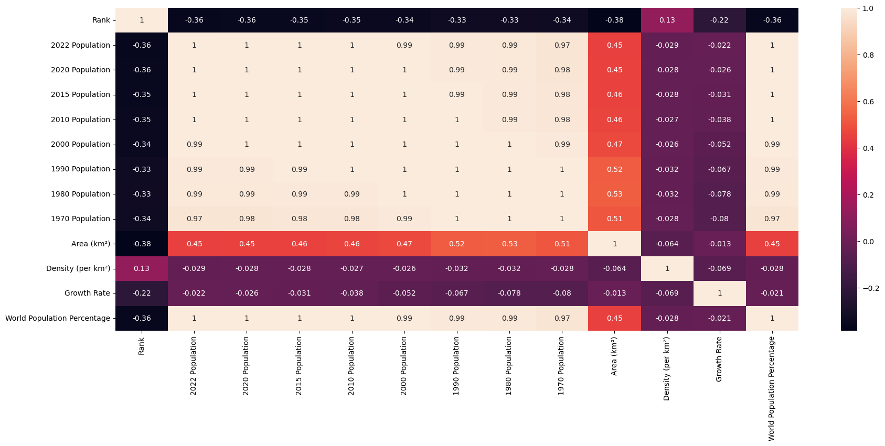
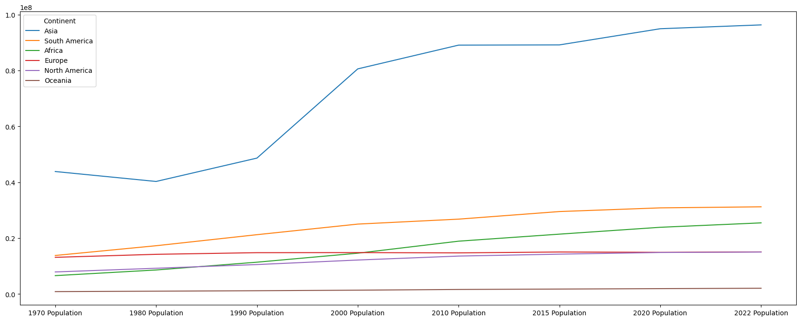
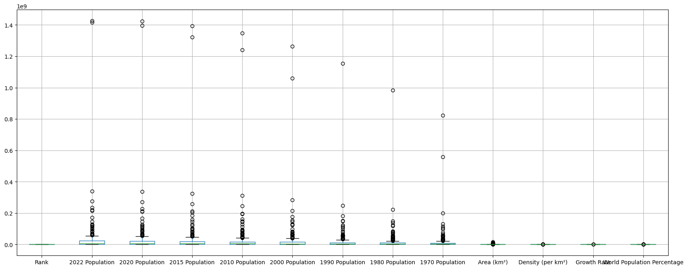

                                           EDA         


```python
import pandas as pd 
import seaborn as sns
import matplotlib.pyplot as plt

```


```python
df = pd.read_csv(r"C:\Users\lmodi\OneDrive\Documents\world_population.csv")
df
```


<div>
<style scoped>
    .dataframe tbody tr th:only-of-type {
        vertical-align: middle;
    }

    .dataframe tbody tr th {
        vertical-align: top;
    }

    .dataframe thead th {
        text-align: right;
    }
</style>
<table border="1" class="dataframe">
  <thead>
    <tr style="text-align: right;">
      <th></th>
      <th>Rank</th>
      <th>CCA3</th>
      <th>Country</th>
      <th>Capital</th>
      <th>Continent</th>
      <th>2022 Population</th>
      <th>2020 Population</th>
      <th>2015 Population</th>
      <th>2010 Population</th>
      <th>2000 Population</th>
      <th>1990 Population</th>
      <th>1980 Population</th>
      <th>1970 Population</th>
      <th>Area (km²)</th>
      <th>Density (per km²)</th>
      <th>Growth Rate</th>
      <th>World Population Percentage</th>
    </tr>
  </thead>
  <tbody>
    <tr>
      <th>0</th>
      <td>36</td>
      <td>AFG</td>
      <td>Afghanistan</td>
      <td>Kabul</td>
      <td>Asia</td>
      <td>41128771.00</td>
      <td>38972230.00</td>
      <td>33753499.00</td>
      <td>28189672.00</td>
      <td>19542982.00</td>
      <td>10694796.00</td>
      <td>12486631.00</td>
      <td>10752971.00</td>
      <td>652230.00</td>
      <td>63.06</td>
      <td>1.03</td>
      <td>0.52</td>
    </tr>
    <tr>
      <th>1</th>
      <td>138</td>
      <td>ALB</td>
      <td>Albania</td>
      <td>Tirana</td>
      <td>Europe</td>
      <td>2842321.00</td>
      <td>2866849.00</td>
      <td>2882481.00</td>
      <td>2913399.00</td>
      <td>3182021.00</td>
      <td>3295066.00</td>
      <td>2941651.00</td>
      <td>2324731.00</td>
      <td>28748.00</td>
      <td>98.87</td>
      <td>1.00</td>
      <td>0.04</td>
    </tr>
    <tr>
      <th>2</th>
      <td>34</td>
      <td>DZA</td>
      <td>Algeria</td>
      <td>Algiers</td>
      <td>Africa</td>
      <td>44903225.00</td>
      <td>43451666.00</td>
      <td>39543154.00</td>
      <td>35856344.00</td>
      <td>30774621.00</td>
      <td>25518074.00</td>
      <td>18739378.00</td>
      <td>13795915.00</td>
      <td>2381741.00</td>
      <td>18.85</td>
      <td>1.02</td>
      <td>0.56</td>
    </tr>
    <tr>
      <th>3</th>
      <td>213</td>
      <td>ASM</td>
      <td>American Samoa</td>
      <td>Pago Pago</td>
      <td>Oceania</td>
      <td>44273.00</td>
      <td>46189.00</td>
      <td>51368.00</td>
      <td>54849.00</td>
      <td>58230.00</td>
      <td>47818.00</td>
      <td>32886.00</td>
      <td>27075.00</td>
      <td>199.00</td>
      <td>222.48</td>
      <td>0.98</td>
      <td>0.00</td>
    </tr>
    <tr>
      <th>4</th>
      <td>203</td>
      <td>AND</td>
      <td>Andorra</td>
      <td>Andorra la Vella</td>
      <td>Europe</td>
      <td>79824.00</td>
      <td>77700.00</td>
      <td>71746.00</td>
      <td>71519.00</td>
      <td>66097.00</td>
      <td>53569.00</td>
      <td>35611.00</td>
      <td>19860.00</td>
      <td>468.00</td>
      <td>170.56</td>
      <td>1.01</td>
      <td>0.00</td>
    </tr>
    <tr>
      <th>...</th>
      <td>...</td>
      <td>...</td>
      <td>...</td>
      <td>...</td>
      <td>...</td>
      <td>...</td>
      <td>...</td>
      <td>...</td>
      <td>...</td>
      <td>...</td>
      <td>...</td>
      <td>...</td>
      <td>...</td>
      <td>...</td>
      <td>...</td>
      <td>...</td>
      <td>...</td>
    </tr>
    <tr>
      <th>229</th>
      <td>226</td>
      <td>WLF</td>
      <td>Wallis and Futuna</td>
      <td>Mata-Utu</td>
      <td>Oceania</td>
      <td>11572.00</td>
      <td>11655.00</td>
      <td>12182.00</td>
      <td>13142.00</td>
      <td>14723.00</td>
      <td>13454.00</td>
      <td>11315.00</td>
      <td>9377.00</td>
      <td>142.00</td>
      <td>81.49</td>
      <td>1.00</td>
      <td>0.00</td>
    </tr>
    <tr>
      <th>230</th>
      <td>172</td>
      <td>ESH</td>
      <td>Western Sahara</td>
      <td>El Aaiún</td>
      <td>Africa</td>
      <td>575986.00</td>
      <td>556048.00</td>
      <td>491824.00</td>
      <td>413296.00</td>
      <td>270375.00</td>
      <td>178529.00</td>
      <td>116775.00</td>
      <td>76371.00</td>
      <td>266000.00</td>
      <td>2.17</td>
      <td>1.02</td>
      <td>0.01</td>
    </tr>
    <tr>
      <th>231</th>
      <td>46</td>
      <td>YEM</td>
      <td>Yemen</td>
      <td>Sanaa</td>
      <td>Asia</td>
      <td>33696614.00</td>
      <td>32284046.00</td>
      <td>28516545.00</td>
      <td>24743946.00</td>
      <td>18628700.00</td>
      <td>13375121.00</td>
      <td>9204938.00</td>
      <td>6843607.00</td>
      <td>527968.00</td>
      <td>63.82</td>
      <td>1.02</td>
      <td>0.42</td>
    </tr>
    <tr>
      <th>232</th>
      <td>63</td>
      <td>ZMB</td>
      <td>Zambia</td>
      <td>Lusaka</td>
      <td>Africa</td>
      <td>20017675.00</td>
      <td>18927715.00</td>
      <td>NaN</td>
      <td>13792086.00</td>
      <td>9891136.00</td>
      <td>7686401.00</td>
      <td>5720438.00</td>
      <td>4281671.00</td>
      <td>752612.00</td>
      <td>26.60</td>
      <td>1.03</td>
      <td>0.25</td>
    </tr>
    <tr>
      <th>233</th>
      <td>74</td>
      <td>ZWE</td>
      <td>Zimbabwe</td>
      <td>Harare</td>
      <td>Africa</td>
      <td>16320537.00</td>
      <td>15669666.00</td>
      <td>14154937.00</td>
      <td>12839771.00</td>
      <td>11834676.00</td>
      <td>10113893.00</td>
      <td>7049926.00</td>
      <td>5202918.00</td>
      <td>390757.00</td>
      <td>41.77</td>
      <td>1.02</td>
      <td>0.20</td>
    </tr>
  </tbody>
</table>
<p>234 rows × 17 columns</p>
</div>


```python
pd.set_option('display.float_format', lambda x: '%.2f' % x)
#pd.set_option('display.float_format', lambda x: '%.1f' % x)
#df = pd.DataFrame({"A":[1.2345, 2.6789]})

df

```


<div>
<style scoped>
    .dataframe tbody tr th:only-of-type {
        vertical-align: middle;
    }

    .dataframe tbody tr th {
        vertical-align: top;
    }

    .dataframe thead th {
        text-align: right;
    }
</style>
<table border="1" class="dataframe">
  <thead>
    <tr style="text-align: right;">
      <th></th>
      <th>Rank</th>
      <th>CCA3</th>
      <th>Country</th>
      <th>Capital</th>
      <th>Continent</th>
      <th>2022 Population</th>
      <th>2020 Population</th>
      <th>2015 Population</th>
      <th>2010 Population</th>
      <th>2000 Population</th>
      <th>1990 Population</th>
      <th>1980 Population</th>
      <th>1970 Population</th>
      <th>Area (km²)</th>
      <th>Density (per km²)</th>
      <th>Growth Rate</th>
      <th>World Population Percentage</th>
    </tr>
  </thead>
  <tbody>
    <tr>
      <th>0</th>
      <td>36</td>
      <td>AFG</td>
      <td>Afghanistan</td>
      <td>Kabul</td>
      <td>Asia</td>
      <td>41128771.00</td>
      <td>38972230.00</td>
      <td>33753499.00</td>
      <td>28189672.00</td>
      <td>19542982.00</td>
      <td>10694796.00</td>
      <td>12486631.00</td>
      <td>10752971.00</td>
      <td>652230.00</td>
      <td>63.06</td>
      <td>1.03</td>
      <td>0.52</td>
    </tr>
    <tr>
      <th>1</th>
      <td>138</td>
      <td>ALB</td>
      <td>Albania</td>
      <td>Tirana</td>
      <td>Europe</td>
      <td>2842321.00</td>
      <td>2866849.00</td>
      <td>2882481.00</td>
      <td>2913399.00</td>
      <td>3182021.00</td>
      <td>3295066.00</td>
      <td>2941651.00</td>
      <td>2324731.00</td>
      <td>28748.00</td>
      <td>98.87</td>
      <td>1.00</td>
      <td>0.04</td>
    </tr>
    <tr>
      <th>2</th>
      <td>34</td>
      <td>DZA</td>
      <td>Algeria</td>
      <td>Algiers</td>
      <td>Africa</td>
      <td>44903225.00</td>
      <td>43451666.00</td>
      <td>39543154.00</td>
      <td>35856344.00</td>
      <td>30774621.00</td>
      <td>25518074.00</td>
      <td>18739378.00</td>
      <td>13795915.00</td>
      <td>2381741.00</td>
      <td>18.85</td>
      <td>1.02</td>
      <td>0.56</td>
    </tr>
    <tr>
      <th>3</th>
      <td>213</td>
      <td>ASM</td>
      <td>American Samoa</td>
      <td>Pago Pago</td>
      <td>Oceania</td>
      <td>44273.00</td>
      <td>46189.00</td>
      <td>51368.00</td>
      <td>54849.00</td>
      <td>58230.00</td>
      <td>47818.00</td>
      <td>32886.00</td>
      <td>27075.00</td>
      <td>199.00</td>
      <td>222.48</td>
      <td>0.98</td>
      <td>0.00</td>
    </tr>
    <tr>
      <th>4</th>
      <td>203</td>
      <td>AND</td>
      <td>Andorra</td>
      <td>Andorra la Vella</td>
      <td>Europe</td>
      <td>79824.00</td>
      <td>77700.00</td>
      <td>71746.00</td>
      <td>71519.00</td>
      <td>66097.00</td>
      <td>53569.00</td>
      <td>35611.00</td>
      <td>19860.00</td>
      <td>468.00</td>
      <td>170.56</td>
      <td>1.01</td>
      <td>0.00</td>
    </tr>
    <tr>
      <th>...</th>
      <td>...</td>
      <td>...</td>
      <td>...</td>
      <td>...</td>
      <td>...</td>
      <td>...</td>
      <td>...</td>
      <td>...</td>
      <td>...</td>
      <td>...</td>
      <td>...</td>
      <td>...</td>
      <td>...</td>
      <td>...</td>
      <td>...</td>
      <td>...</td>
      <td>...</td>
    </tr>
    <tr>
      <th>229</th>
      <td>226</td>
      <td>WLF</td>
      <td>Wallis and Futuna</td>
      <td>Mata-Utu</td>
      <td>Oceania</td>
      <td>11572.00</td>
      <td>11655.00</td>
      <td>12182.00</td>
      <td>13142.00</td>
      <td>14723.00</td>
      <td>13454.00</td>
      <td>11315.00</td>
      <td>9377.00</td>
      <td>142.00</td>
      <td>81.49</td>
      <td>1.00</td>
      <td>0.00</td>
    </tr>
    <tr>
      <th>230</th>
      <td>172</td>
      <td>ESH</td>
      <td>Western Sahara</td>
      <td>El Aaiún</td>
      <td>Africa</td>
      <td>575986.00</td>
      <td>556048.00</td>
      <td>491824.00</td>
      <td>413296.00</td>
      <td>270375.00</td>
      <td>178529.00</td>
      <td>116775.00</td>
      <td>76371.00</td>
      <td>266000.00</td>
      <td>2.17</td>
      <td>1.02</td>
      <td>0.01</td>
    </tr>
    <tr>
      <th>231</th>
      <td>46</td>
      <td>YEM</td>
      <td>Yemen</td>
      <td>Sanaa</td>
      <td>Asia</td>
      <td>33696614.00</td>
      <td>32284046.00</td>
      <td>28516545.00</td>
      <td>24743946.00</td>
      <td>18628700.00</td>
      <td>13375121.00</td>
      <td>9204938.00</td>
      <td>6843607.00</td>
      <td>527968.00</td>
      <td>63.82</td>
      <td>1.02</td>
      <td>0.42</td>
    </tr>
    <tr>
      <th>232</th>
      <td>63</td>
      <td>ZMB</td>
      <td>Zambia</td>
      <td>Lusaka</td>
      <td>Africa</td>
      <td>20017675.00</td>
      <td>18927715.00</td>
      <td>NaN</td>
      <td>13792086.00</td>
      <td>9891136.00</td>
      <td>7686401.00</td>
      <td>5720438.00</td>
      <td>4281671.00</td>
      <td>752612.00</td>
      <td>26.60</td>
      <td>1.03</td>
      <td>0.25</td>
    </tr>
    <tr>
      <th>233</th>
      <td>74</td>
      <td>ZWE</td>
      <td>Zimbabwe</td>
      <td>Harare</td>
      <td>Africa</td>
      <td>16320537.00</td>
      <td>15669666.00</td>
      <td>14154937.00</td>
      <td>12839771.00</td>
      <td>11834676.00</td>
      <td>10113893.00</td>
      <td>7049926.00</td>
      <td>5202918.00</td>
      <td>390757.00</td>
      <td>41.77</td>
      <td>1.02</td>
      <td>0.20</td>
    </tr>
  </tbody>
</table>
<p>234 rows × 17 columns</p>
</div>


```python
df.info()
```

    <class 'pandas.core.frame.DataFrame'>
    RangeIndex: 234 entries, 0 to 233
    Data columns (total 17 columns):
     #   Column                       Non-Null Count  Dtype  
    ---  ------                       --------------  -----  
     0   Rank                         234 non-null    int64  
     1   CCA3                         234 non-null    object 
     2   Country                      234 non-null    object 
     3   Capital                      234 non-null    object 
     4   Continent                    234 non-null    object 
     5   2022 Population              230 non-null    float64
     6   2020 Population              233 non-null    float64
     7   2015 Population              230 non-null    float64
     8   2010 Population              227 non-null    float64
     9   2000 Population              227 non-null    float64
     10  1990 Population              229 non-null    float64
     11  1980 Population              229 non-null    float64
     12  1970 Population              230 non-null    float64
     13  Area (km²)                   232 non-null    float64
     14  Density (per km²)            230 non-null    float64
     15  Growth Rate                  232 non-null    float64
     16  World Population Percentage  234 non-null    float64
    dtypes: float64(12), int64(1), object(4)
    memory usage: 31.2+ KB
    


```python
df.describe()
```


<div>
<style scoped>
    .dataframe tbody tr th:only-of-type {
        vertical-align: middle;
    }

    .dataframe tbody tr th {
        vertical-align: top;
    }

    .dataframe thead th {
        text-align: right;
    }
</style>
<table border="1" class="dataframe">
  <thead>
    <tr style="text-align: right;">
      <th></th>
      <th>Rank</th>
      <th>2022 Population</th>
      <th>2020 Population</th>
      <th>2015 Population</th>
      <th>2010 Population</th>
      <th>2000 Population</th>
      <th>1990 Population</th>
      <th>1980 Population</th>
      <th>1970 Population</th>
      <th>Area (km²)</th>
      <th>Density (per km²)</th>
      <th>Growth Rate</th>
      <th>World Population Percentage</th>
    </tr>
  </thead>
  <tbody>
    <tr>
      <th>count</th>
      <td>234.00</td>
      <td>230.00</td>
      <td>233.00</td>
      <td>230.00</td>
      <td>227.00</td>
      <td>227.00</td>
      <td>229.00</td>
      <td>229.00</td>
      <td>230.00</td>
      <td>232.00</td>
      <td>230.00</td>
      <td>232.00</td>
      <td>234.00</td>
    </tr>
    <tr>
      <th>mean</th>
      <td>117.50</td>
      <td>34632250.88</td>
      <td>33600710.95</td>
      <td>32066004.16</td>
      <td>30270164.48</td>
      <td>26840495.26</td>
      <td>19330463.93</td>
      <td>16282884.78</td>
      <td>15866499.13</td>
      <td>581663.75</td>
      <td>456.81</td>
      <td>1.01</td>
      <td>0.43</td>
    </tr>
    <tr>
      <th>std</th>
      <td>67.69</td>
      <td>137889172.44</td>
      <td>135873196.61</td>
      <td>131507146.34</td>
      <td>126074183.54</td>
      <td>113352454.57</td>
      <td>81309624.96</td>
      <td>69345465.54</td>
      <td>68355859.75</td>
      <td>1769133.06</td>
      <td>2083.74</td>
      <td>0.01</td>
      <td>1.71</td>
    </tr>
    <tr>
      <th>min</th>
      <td>1.00</td>
      <td>510.00</td>
      <td>520.00</td>
      <td>564.00</td>
      <td>596.00</td>
      <td>651.00</td>
      <td>700.00</td>
      <td>733.00</td>
      <td>752.00</td>
      <td>1.00</td>
      <td>0.03</td>
      <td>0.91</td>
      <td>0.00</td>
    </tr>
    <tr>
      <th>25%</th>
      <td>59.25</td>
      <td>419738.50</td>
      <td>406471.00</td>
      <td>394295.00</td>
      <td>382726.50</td>
      <td>329470.00</td>
      <td>261928.00</td>
      <td>223752.00</td>
      <td>145880.50</td>
      <td>2567.25</td>
      <td>36.60</td>
      <td>1.00</td>
      <td>0.01</td>
    </tr>
    <tr>
      <th>50%</th>
      <td>117.50</td>
      <td>5762857.00</td>
      <td>5456681.00</td>
      <td>5244415.00</td>
      <td>4889741.00</td>
      <td>4491202.00</td>
      <td>3785847.00</td>
      <td>3135123.00</td>
      <td>2511718.00</td>
      <td>77141.00</td>
      <td>95.35</td>
      <td>1.01</td>
      <td>0.07</td>
    </tr>
    <tr>
      <th>75%</th>
      <td>175.75</td>
      <td>22653719.00</td>
      <td>21522626.00</td>
      <td>19730853.75</td>
      <td>16825852.50</td>
      <td>15625467.00</td>
      <td>11882762.00</td>
      <td>9817257.00</td>
      <td>8817329.00</td>
      <td>414643.25</td>
      <td>236.88</td>
      <td>1.02</td>
      <td>0.28</td>
    </tr>
    <tr>
      <th>max</th>
      <td>234.00</td>
      <td>1425887337.00</td>
      <td>1424929781.00</td>
      <td>1393715448.00</td>
      <td>1348191368.00</td>
      <td>1264099069.00</td>
      <td>1153704252.00</td>
      <td>982372466.00</td>
      <td>822534450.00</td>
      <td>17098242.00</td>
      <td>23172.27</td>
      <td>1.07</td>
      <td>17.88</td>
    </tr>
  </tbody>
</table>
</div>


```python
df.isnull().sum()
```


    Rank                           0
    CCA3                           0
    Country                        0
    Capital                        0
    Continent                      0
    2022 Population                4
    2020 Population                1
    2015 Population                4
    2010 Population                7
    2000 Population                7
    1990 Population                5
    1980 Population                5
    1970 Population                4
    Area (km²)                     2
    Density (per km²)              4
    Growth Rate                    2
    World Population Percentage    0
    dtype: int64


```python
df.nunique()
```


    Rank                           234
    CCA3                           234
    Country                        234
    Capital                        234
    Continent                        6
    2022 Population                230
    2020 Population                233
    2015 Population                230
    2010 Population                227
    2000 Population                227
    1990 Population                229
    1980 Population                229
    1970 Population                230
    Area (km²)                     231
    Density (per km²)              230
    Growth Rate                    178
    World Population Percentage     70
    dtype: int64


```python
df.sort_values(by='World Population Percentage', ascending=False).head()
```


<div>
<style scoped>
    .dataframe tbody tr th:only-of-type {
        vertical-align: middle;
    }

    .dataframe tbody tr th {
        vertical-align: top;
    }

    .dataframe thead th {
        text-align: right;
    }
</style>
<table border="1" class="dataframe">
  <thead>
    <tr style="text-align: right;">
      <th></th>
      <th>Rank</th>
      <th>CCA3</th>
      <th>Country</th>
      <th>Capital</th>
      <th>Continent</th>
      <th>2022 Population</th>
      <th>2020 Population</th>
      <th>2015 Population</th>
      <th>2010 Population</th>
      <th>2000 Population</th>
      <th>1990 Population</th>
      <th>1980 Population</th>
      <th>1970 Population</th>
      <th>Area (km²)</th>
      <th>Density (per km²)</th>
      <th>Growth Rate</th>
      <th>World Population Percentage</th>
    </tr>
  </thead>
  <tbody>
    <tr>
      <th>41</th>
      <td>1</td>
      <td>CHN</td>
      <td>China</td>
      <td>Beijing</td>
      <td>Asia</td>
      <td>1425887337.00</td>
      <td>1424929781.00</td>
      <td>1393715448.00</td>
      <td>1348191368.00</td>
      <td>1264099069.00</td>
      <td>1153704252.00</td>
      <td>982372466.00</td>
      <td>822534450.00</td>
      <td>9706961.00</td>
      <td>146.89</td>
      <td>1.00</td>
      <td>17.88</td>
    </tr>
    <tr>
      <th>92</th>
      <td>2</td>
      <td>IND</td>
      <td>India</td>
      <td>New Delhi</td>
      <td>Asia</td>
      <td>1417173173.00</td>
      <td>1396387127.00</td>
      <td>1322866505.00</td>
      <td>1240613620.00</td>
      <td>1059633675.00</td>
      <td>NaN</td>
      <td>NaN</td>
      <td>557501301.00</td>
      <td>3287590.00</td>
      <td>431.07</td>
      <td>1.01</td>
      <td>17.77</td>
    </tr>
    <tr>
      <th>221</th>
      <td>3</td>
      <td>USA</td>
      <td>United States</td>
      <td>Washington, D.C.</td>
      <td>North America</td>
      <td>338289857.00</td>
      <td>335942003.00</td>
      <td>324607776.00</td>
      <td>311182845.00</td>
      <td>282398554.00</td>
      <td>248083732.00</td>
      <td>223140018.00</td>
      <td>200328340.00</td>
      <td>9372610.00</td>
      <td>36.09</td>
      <td>1.00</td>
      <td>4.24</td>
    </tr>
    <tr>
      <th>93</th>
      <td>4</td>
      <td>IDN</td>
      <td>Indonesia</td>
      <td>Jakarta</td>
      <td>Asia</td>
      <td>275501339.00</td>
      <td>271857970.00</td>
      <td>259091970.00</td>
      <td>244016173.00</td>
      <td>214072421.00</td>
      <td>182159874.00</td>
      <td>148177096.00</td>
      <td>115228394.00</td>
      <td>1904569.00</td>
      <td>144.65</td>
      <td>1.01</td>
      <td>3.45</td>
    </tr>
    <tr>
      <th>156</th>
      <td>5</td>
      <td>PAK</td>
      <td>Pakistan</td>
      <td>Islamabad</td>
      <td>Asia</td>
      <td>235824862.00</td>
      <td>227196741.00</td>
      <td>210969298.00</td>
      <td>194454498.00</td>
      <td>154369924.00</td>
      <td>115414069.00</td>
      <td>80624057.00</td>
      <td>59290872.00</td>
      <td>881912.00</td>
      <td>267.40</td>
      <td>1.02</td>
      <td>2.96</td>
    </tr>
  </tbody>
</table>
</div>


```python
df.corr(numeric_only=True)
```


<div>
<style scoped>
    .dataframe tbody tr th:only-of-type {
        vertical-align: middle;
    }

    .dataframe tbody tr th {
        vertical-align: top;
    }

    .dataframe thead th {
        text-align: right;
    }
</style>
<table border="1" class="dataframe">
  <thead>
    <tr style="text-align: right;">
      <th></th>
      <th>Rank</th>
      <th>2022 Population</th>
      <th>2020 Population</th>
      <th>2015 Population</th>
      <th>2010 Population</th>
      <th>2000 Population</th>
      <th>1990 Population</th>
      <th>1980 Population</th>
      <th>1970 Population</th>
      <th>Area (km²)</th>
      <th>Density (per km²)</th>
      <th>Growth Rate</th>
      <th>World Population Percentage</th>
    </tr>
  </thead>
  <tbody>
    <tr>
      <th>Rank</th>
      <td>1.00</td>
      <td>-0.36</td>
      <td>-0.36</td>
      <td>-0.35</td>
      <td>-0.35</td>
      <td>-0.34</td>
      <td>-0.33</td>
      <td>-0.33</td>
      <td>-0.34</td>
      <td>-0.38</td>
      <td>0.13</td>
      <td>-0.22</td>
      <td>-0.36</td>
    </tr>
    <tr>
      <th>2022 Population</th>
      <td>-0.36</td>
      <td>1.00</td>
      <td>1.00</td>
      <td>1.00</td>
      <td>1.00</td>
      <td>0.99</td>
      <td>0.99</td>
      <td>0.99</td>
      <td>0.97</td>
      <td>0.45</td>
      <td>-0.03</td>
      <td>-0.02</td>
      <td>1.00</td>
    </tr>
    <tr>
      <th>2020 Population</th>
      <td>-0.36</td>
      <td>1.00</td>
      <td>1.00</td>
      <td>1.00</td>
      <td>1.00</td>
      <td>1.00</td>
      <td>0.99</td>
      <td>0.99</td>
      <td>0.98</td>
      <td>0.45</td>
      <td>-0.03</td>
      <td>-0.03</td>
      <td>1.00</td>
    </tr>
    <tr>
      <th>2015 Population</th>
      <td>-0.35</td>
      <td>1.00</td>
      <td>1.00</td>
      <td>1.00</td>
      <td>1.00</td>
      <td>1.00</td>
      <td>0.99</td>
      <td>0.99</td>
      <td>0.98</td>
      <td>0.46</td>
      <td>-0.03</td>
      <td>-0.03</td>
      <td>1.00</td>
    </tr>
    <tr>
      <th>2010 Population</th>
      <td>-0.35</td>
      <td>1.00</td>
      <td>1.00</td>
      <td>1.00</td>
      <td>1.00</td>
      <td>1.00</td>
      <td>1.00</td>
      <td>0.99</td>
      <td>0.98</td>
      <td>0.46</td>
      <td>-0.03</td>
      <td>-0.04</td>
      <td>1.00</td>
    </tr>
    <tr>
      <th>2000 Population</th>
      <td>-0.34</td>
      <td>0.99</td>
      <td>1.00</td>
      <td>1.00</td>
      <td>1.00</td>
      <td>1.00</td>
      <td>1.00</td>
      <td>1.00</td>
      <td>0.99</td>
      <td>0.47</td>
      <td>-0.03</td>
      <td>-0.05</td>
      <td>0.99</td>
    </tr>
    <tr>
      <th>1990 Population</th>
      <td>-0.33</td>
      <td>0.99</td>
      <td>0.99</td>
      <td>0.99</td>
      <td>1.00</td>
      <td>1.00</td>
      <td>1.00</td>
      <td>1.00</td>
      <td>1.00</td>
      <td>0.52</td>
      <td>-0.03</td>
      <td>-0.07</td>
      <td>0.99</td>
    </tr>
    <tr>
      <th>1980 Population</th>
      <td>-0.33</td>
      <td>0.99</td>
      <td>0.99</td>
      <td>0.99</td>
      <td>0.99</td>
      <td>1.00</td>
      <td>1.00</td>
      <td>1.00</td>
      <td>1.00</td>
      <td>0.53</td>
      <td>-0.03</td>
      <td>-0.08</td>
      <td>0.99</td>
    </tr>
    <tr>
      <th>1970 Population</th>
      <td>-0.34</td>
      <td>0.97</td>
      <td>0.98</td>
      <td>0.98</td>
      <td>0.98</td>
      <td>0.99</td>
      <td>1.00</td>
      <td>1.00</td>
      <td>1.00</td>
      <td>0.51</td>
      <td>-0.03</td>
      <td>-0.08</td>
      <td>0.97</td>
    </tr>
    <tr>
      <th>Area (km²)</th>
      <td>-0.38</td>
      <td>0.45</td>
      <td>0.45</td>
      <td>0.46</td>
      <td>0.46</td>
      <td>0.47</td>
      <td>0.52</td>
      <td>0.53</td>
      <td>0.51</td>
      <td>1.00</td>
      <td>-0.06</td>
      <td>-0.01</td>
      <td>0.45</td>
    </tr>
    <tr>
      <th>Density (per km²)</th>
      <td>0.13</td>
      <td>-0.03</td>
      <td>-0.03</td>
      <td>-0.03</td>
      <td>-0.03</td>
      <td>-0.03</td>
      <td>-0.03</td>
      <td>-0.03</td>
      <td>-0.03</td>
      <td>-0.06</td>
      <td>1.00</td>
      <td>-0.07</td>
      <td>-0.03</td>
    </tr>
    <tr>
      <th>Growth Rate</th>
      <td>-0.22</td>
      <td>-0.02</td>
      <td>-0.03</td>
      <td>-0.03</td>
      <td>-0.04</td>
      <td>-0.05</td>
      <td>-0.07</td>
      <td>-0.08</td>
      <td>-0.08</td>
      <td>-0.01</td>
      <td>-0.07</td>
      <td>1.00</td>
      <td>-0.02</td>
    </tr>
    <tr>
      <th>World Population Percentage</th>
      <td>-0.36</td>
      <td>1.00</td>
      <td>1.00</td>
      <td>1.00</td>
      <td>1.00</td>
      <td>0.99</td>
      <td>0.99</td>
      <td>0.99</td>
      <td>0.97</td>
      <td>0.45</td>
      <td>-0.03</td>
      <td>-0.02</td>
      <td>1.00</td>
    </tr>
  </tbody>
</table>
</div>


```python
sns.heatmap(df.corr(numeric_only=True),annot=True)

plt.rcParams['figure.figsize'] =(21,8)

plt.show()
```


    

    


```python
#df.groupby("Continent").mean()
numeric_cols = df.select_dtypes(include=['number']).columns
df.groupby("Continent")[numeric_cols].mean().sort_values(by="2022 Population",ascending=False)

```


<div>
<style scoped>
    .dataframe tbody tr th:only-of-type {
        vertical-align: middle;
    }

    .dataframe tbody tr th {
        vertical-align: top;
    }

    .dataframe thead th {
        text-align: right;
    }
</style>
<table border="1" class="dataframe">
  <thead>
    <tr style="text-align: right;">
      <th></th>
      <th>Rank</th>
      <th>2022 Population</th>
      <th>2020 Population</th>
      <th>2015 Population</th>
      <th>2010 Population</th>
      <th>2000 Population</th>
      <th>1990 Population</th>
      <th>1980 Population</th>
      <th>1970 Population</th>
      <th>Area (km²)</th>
      <th>Density (per km²)</th>
      <th>Growth Rate</th>
      <th>World Population Percentage</th>
    </tr>
    <tr>
      <th>Continent</th>
      <th></th>
      <th></th>
      <th></th>
      <th></th>
      <th></th>
      <th></th>
      <th></th>
      <th></th>
      <th></th>
      <th></th>
      <th></th>
      <th></th>
      <th></th>
    </tr>
  </thead>
  <tbody>
    <tr>
      <th>Asia</th>
      <td>77.56</td>
      <td>96327387.31</td>
      <td>94955134.37</td>
      <td>89165003.64</td>
      <td>89087770.00</td>
      <td>80580835.11</td>
      <td>48639995.33</td>
      <td>40278333.33</td>
      <td>43839877.83</td>
      <td>642762.82</td>
      <td>1025.02</td>
      <td>1.01</td>
      <td>1.18</td>
    </tr>
    <tr>
      <th>South America</th>
      <td>97.57</td>
      <td>31201186.29</td>
      <td>30823574.50</td>
      <td>29509599.71</td>
      <td>26789395.54</td>
      <td>25015888.69</td>
      <td>21224743.93</td>
      <td>17270643.29</td>
      <td>13781939.71</td>
      <td>1301302.85</td>
      <td>20.97</td>
      <td>1.01</td>
      <td>0.39</td>
    </tr>
    <tr>
      <th>Africa</th>
      <td>92.16</td>
      <td>25455879.68</td>
      <td>23871435.26</td>
      <td>21419703.57</td>
      <td>18898197.31</td>
      <td>14598365.95</td>
      <td>11376964.52</td>
      <td>8586031.98</td>
      <td>6567175.27</td>
      <td>537879.30</td>
      <td>126.41</td>
      <td>1.02</td>
      <td>0.31</td>
    </tr>
    <tr>
      <th>Europe</th>
      <td>124.50</td>
      <td>15055371.82</td>
      <td>14915843.92</td>
      <td>15027454.12</td>
      <td>14712278.68</td>
      <td>14817685.71</td>
      <td>14785203.94</td>
      <td>14200004.52</td>
      <td>13118479.82</td>
      <td>460208.22</td>
      <td>663.32</td>
      <td>1.00</td>
      <td>0.19</td>
    </tr>
    <tr>
      <th>North America</th>
      <td>160.93</td>
      <td>15007403.40</td>
      <td>14855914.82</td>
      <td>14259596.25</td>
      <td>13568016.28</td>
      <td>12151739.60</td>
      <td>10531660.62</td>
      <td>9207334.03</td>
      <td>7885865.15</td>
      <td>606104.45</td>
      <td>272.49</td>
      <td>1.00</td>
      <td>0.19</td>
    </tr>
    <tr>
      <th>Oceania</th>
      <td>188.52</td>
      <td>2046386.32</td>
      <td>1910148.96</td>
      <td>1756664.48</td>
      <td>1613163.65</td>
      <td>1357512.09</td>
      <td>1162774.87</td>
      <td>996532.17</td>
      <td>846968.26</td>
      <td>370220.91</td>
      <td>132.54</td>
      <td>1.01</td>
      <td>0.02</td>
    </tr>
  </tbody>
</table>
</div>


```python

```


```python
numeric_cols = df.select_dtypes(include=['number']).columns
df2 = df.groupby("Continent") [['1970 Population', '1980 Population', '1990 Population',
       '2000 Population', '2010 Population', '2015 Population',
       '2020 Population', '2022 Population']].mean().sort_values(by="2022 Population",ascending=False)
df2
```


<div>
<style scoped>
    .dataframe tbody tr th:only-of-type {
        vertical-align: middle;
    }

    .dataframe tbody tr th {
        vertical-align: top;
    }

    .dataframe thead th {
        text-align: right;
    }
</style>
<table border="1" class="dataframe">
  <thead>
    <tr style="text-align: right;">
      <th></th>
      <th>1970 Population</th>
      <th>1980 Population</th>
      <th>1990 Population</th>
      <th>2000 Population</th>
      <th>2010 Population</th>
      <th>2015 Population</th>
      <th>2020 Population</th>
      <th>2022 Population</th>
    </tr>
    <tr>
      <th>Continent</th>
      <th></th>
      <th></th>
      <th></th>
      <th></th>
      <th></th>
      <th></th>
      <th></th>
      <th></th>
    </tr>
  </thead>
  <tbody>
    <tr>
      <th>Asia</th>
      <td>43839877.83</td>
      <td>40278333.33</td>
      <td>48639995.33</td>
      <td>80580835.11</td>
      <td>89087770.00</td>
      <td>89165003.64</td>
      <td>94955134.37</td>
      <td>96327387.31</td>
    </tr>
    <tr>
      <th>South America</th>
      <td>13781939.71</td>
      <td>17270643.29</td>
      <td>21224743.93</td>
      <td>25015888.69</td>
      <td>26789395.54</td>
      <td>29509599.71</td>
      <td>30823574.50</td>
      <td>31201186.29</td>
    </tr>
    <tr>
      <th>Africa</th>
      <td>6567175.27</td>
      <td>8586031.98</td>
      <td>11376964.52</td>
      <td>14598365.95</td>
      <td>18898197.31</td>
      <td>21419703.57</td>
      <td>23871435.26</td>
      <td>25455879.68</td>
    </tr>
    <tr>
      <th>Europe</th>
      <td>13118479.82</td>
      <td>14200004.52</td>
      <td>14785203.94</td>
      <td>14817685.71</td>
      <td>14712278.68</td>
      <td>15027454.12</td>
      <td>14915843.92</td>
      <td>15055371.82</td>
    </tr>
    <tr>
      <th>North America</th>
      <td>7885865.15</td>
      <td>9207334.03</td>
      <td>10531660.62</td>
      <td>12151739.60</td>
      <td>13568016.28</td>
      <td>14259596.25</td>
      <td>14855914.82</td>
      <td>15007403.40</td>
    </tr>
    <tr>
      <th>Oceania</th>
      <td>846968.26</td>
      <td>996532.17</td>
      <td>1162774.87</td>
      <td>1357512.09</td>
      <td>1613163.65</td>
      <td>1756664.48</td>
      <td>1910148.96</td>
      <td>2046386.32</td>
    </tr>
  </tbody>
</table>
</div>


```python
df.columns
```


    Index(['Rank', 'CCA3', 'Country', 'Capital', 'Continent', '2022 Population',
           '2020 Population', '2015 Population', '2010 Population',
           '2000 Population', '1990 Population', '1980 Population',
           '1970 Population', 'Area (km²)', 'Density (per km²)', 'Growth Rate',
           'World Population Percentage'],
          dtype='object')


```python
df3 = df2.transpose()
df3
```


<div>
<style scoped>
    .dataframe tbody tr th:only-of-type {
        vertical-align: middle;
    }

    .dataframe tbody tr th {
        vertical-align: top;
    }

    .dataframe thead th {
        text-align: right;
    }
</style>
<table border="1" class="dataframe">
  <thead>
    <tr style="text-align: right;">
      <th>Continent</th>
      <th>Asia</th>
      <th>South America</th>
      <th>Africa</th>
      <th>Europe</th>
      <th>North America</th>
      <th>Oceania</th>
    </tr>
  </thead>
  <tbody>
    <tr>
      <th>1970 Population</th>
      <td>43839877.83</td>
      <td>13781939.71</td>
      <td>6567175.27</td>
      <td>13118479.82</td>
      <td>7885865.15</td>
      <td>846968.26</td>
    </tr>
    <tr>
      <th>1980 Population</th>
      <td>40278333.33</td>
      <td>17270643.29</td>
      <td>8586031.98</td>
      <td>14200004.52</td>
      <td>9207334.03</td>
      <td>996532.17</td>
    </tr>
    <tr>
      <th>1990 Population</th>
      <td>48639995.33</td>
      <td>21224743.93</td>
      <td>11376964.52</td>
      <td>14785203.94</td>
      <td>10531660.62</td>
      <td>1162774.87</td>
    </tr>
    <tr>
      <th>2000 Population</th>
      <td>80580835.11</td>
      <td>25015888.69</td>
      <td>14598365.95</td>
      <td>14817685.71</td>
      <td>12151739.60</td>
      <td>1357512.09</td>
    </tr>
    <tr>
      <th>2010 Population</th>
      <td>89087770.00</td>
      <td>26789395.54</td>
      <td>18898197.31</td>
      <td>14712278.68</td>
      <td>13568016.28</td>
      <td>1613163.65</td>
    </tr>
    <tr>
      <th>2015 Population</th>
      <td>89165003.64</td>
      <td>29509599.71</td>
      <td>21419703.57</td>
      <td>15027454.12</td>
      <td>14259596.25</td>
      <td>1756664.48</td>
    </tr>
    <tr>
      <th>2020 Population</th>
      <td>94955134.37</td>
      <td>30823574.50</td>
      <td>23871435.26</td>
      <td>14915843.92</td>
      <td>14855914.82</td>
      <td>1910148.96</td>
    </tr>
    <tr>
      <th>2022 Population</th>
      <td>96327387.31</td>
      <td>31201186.29</td>
      <td>25455879.68</td>
      <td>15055371.82</td>
      <td>15007403.40</td>
      <td>2046386.32</td>
    </tr>
  </tbody>
</table>
</div>


```python
df3.plot()
```


    <Axes: >


    

    


```python

```


```python
df.boxplot()
```


    <Axes: >


    

    


```python

```


```python
df.select_dtypes(include="object")
```


<div>
<style scoped>
    .dataframe tbody tr th:only-of-type {
        vertical-align: middle;
    }

    .dataframe tbody tr th {
        vertical-align: top;
    }

    .dataframe thead th {
        text-align: right;
    }
</style>
<table border="1" class="dataframe">
  <thead>
    <tr style="text-align: right;">
      <th></th>
      <th>CCA3</th>
      <th>Country</th>
      <th>Capital</th>
      <th>Continent</th>
    </tr>
  </thead>
  <tbody>
    <tr>
      <th>0</th>
      <td>AFG</td>
      <td>Afghanistan</td>
      <td>Kabul</td>
      <td>Asia</td>
    </tr>
    <tr>
      <th>1</th>
      <td>ALB</td>
      <td>Albania</td>
      <td>Tirana</td>
      <td>Europe</td>
    </tr>
    <tr>
      <th>2</th>
      <td>DZA</td>
      <td>Algeria</td>
      <td>Algiers</td>
      <td>Africa</td>
    </tr>
    <tr>
      <th>3</th>
      <td>ASM</td>
      <td>American Samoa</td>
      <td>Pago Pago</td>
      <td>Oceania</td>
    </tr>
    <tr>
      <th>4</th>
      <td>AND</td>
      <td>Andorra</td>
      <td>Andorra la Vella</td>
      <td>Europe</td>
    </tr>
    <tr>
      <th>...</th>
      <td>...</td>
      <td>...</td>
      <td>...</td>
      <td>...</td>
    </tr>
    <tr>
      <th>229</th>
      <td>WLF</td>
      <td>Wallis and Futuna</td>
      <td>Mata-Utu</td>
      <td>Oceania</td>
    </tr>
    <tr>
      <th>230</th>
      <td>ESH</td>
      <td>Western Sahara</td>
      <td>El Aaiún</td>
      <td>Africa</td>
    </tr>
    <tr>
      <th>231</th>
      <td>YEM</td>
      <td>Yemen</td>
      <td>Sanaa</td>
      <td>Asia</td>
    </tr>
    <tr>
      <th>232</th>
      <td>ZMB</td>
      <td>Zambia</td>
      <td>Lusaka</td>
      <td>Africa</td>
    </tr>
    <tr>
      <th>233</th>
      <td>ZWE</td>
      <td>Zimbabwe</td>
      <td>Harare</td>
      <td>Africa</td>
    </tr>
  </tbody>
</table>
<p>234 rows × 4 columns</p>
</div>


```python

```


```python

```


```python

```


```python

```


```python

```


```python

```


```python

```


```python

```


```python

```


```python

```


```python

```


```python

```


```python

```


```python

```


```python

```
